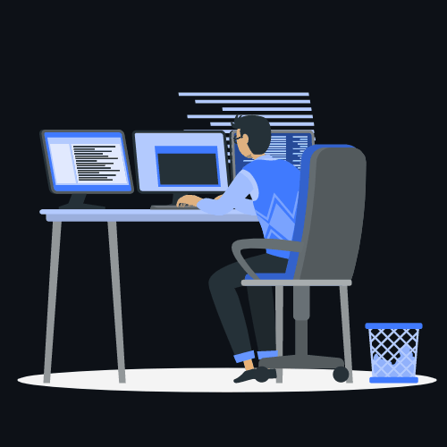

  <!-- HEADER -->
  <table border="0" width="100%">
    <tr>
      <td width="55%" align="center" valign="middle">
        <h1>Olá, eu sou o Mateus Silva! 👋</h1>
        <h3>Software Engineer | Java Backend</h3>
         
        

          Graduado em <b>Análise e Desenvolvimento de Sistemas</b>. 
          Engenheiro de Software em formação, focado no desenvolvimento Backend com <b>Java</b>,
          sempre priorizando código limpo e organizado.
        

      </td>
      <td width="45%" align="center" valign="middle">
        
      </td>
    </tr>
  </table>

   
  
    

  <!-- SKILLS -->
  <table border="0" width="100%" style="table-layout: fixed;">
    <tr>
      <td width="55%" align="center" valign="middle">
        <h3>☕ Linguagens (Core)</h3>
        
      </td>
      <td width="45%" align="center" valign="middle" rowspan="2">
        <h3>⚙️ Ferramentas & IDE</h3>
        
          
      </td>
    </tr>
    <tr>
      <td align="center" valign="middle">
        <h4 style="white-space: nowrap;">🗄️ Banco de Dados & Frameworks</h4>
        <!-- EM BREVE
        
         
        <i>(Spring em breve)</i>
        -->
      </td>
    </tr>
  </table>

   
  
    
  
  
  
  ## 💻 Projetos & Portfólio
  
  <table width="100%" align="center">
    <tr>
      <td width="50%" align="center" valign="top">
  
  <h3 align="center">🎟️ TicketHub</h3>
  
Sistema corporativo de gestão de eventos e bilheteria.

  
  

    
  

  
  

    
  

  
  

    
  

      </td>
      <td width="50%" align="center" valign="top">
  
  <h3 align="center">📌 Nome do Projeto 2</h3>
  
Descrição do projeto...

  
  

    
  

  
  

    
  

  
  

    
  

      </td>
    </tr>
    <tr>
      <td width="50%" align="center" valign="top">
  
  <h3 align="center">📌 Nome do Projeto 3</h3>
  
Descrição do projeto...

  
  

    
  

  
  

    
  

  
  

    
  

      </td>
      <td width="50%" align="center" valign="top">
  
  <h3 align="center">📌 Nome do Projeto 4</h3>
  
Descrição do projeto...

  
  

    
  

  
  

    
  

  
  

    
  

      </td>
    </tr>
  </table>

   
  
    
  
<!-- CONTACT -->
  <h2 align="center">🤝 Vamos Conversar?</h2>

  

    
      
    <i>Estou disponível para novas oportunidades e conexões!</i>
  

  

<!-- ICONES: https://github.com/tandpfun/skill-icons#readme -->
